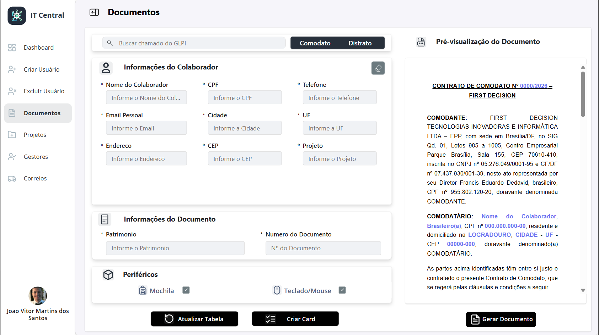
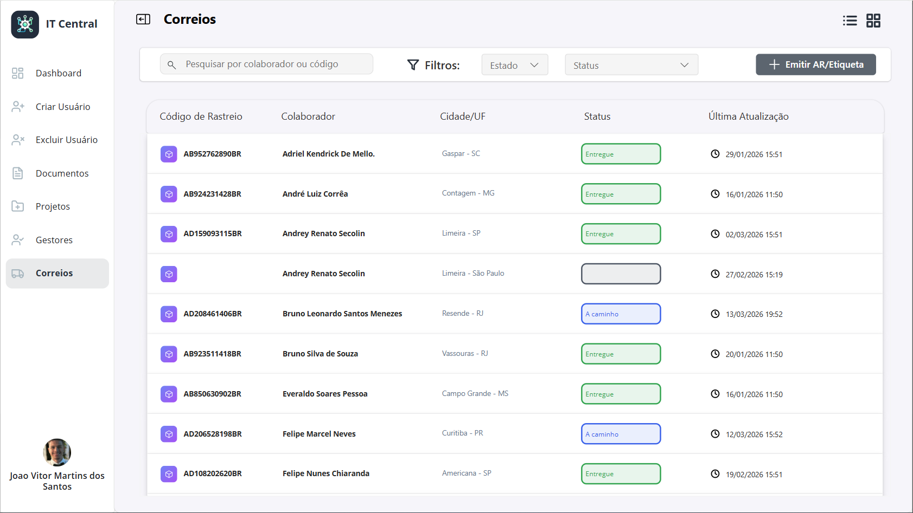
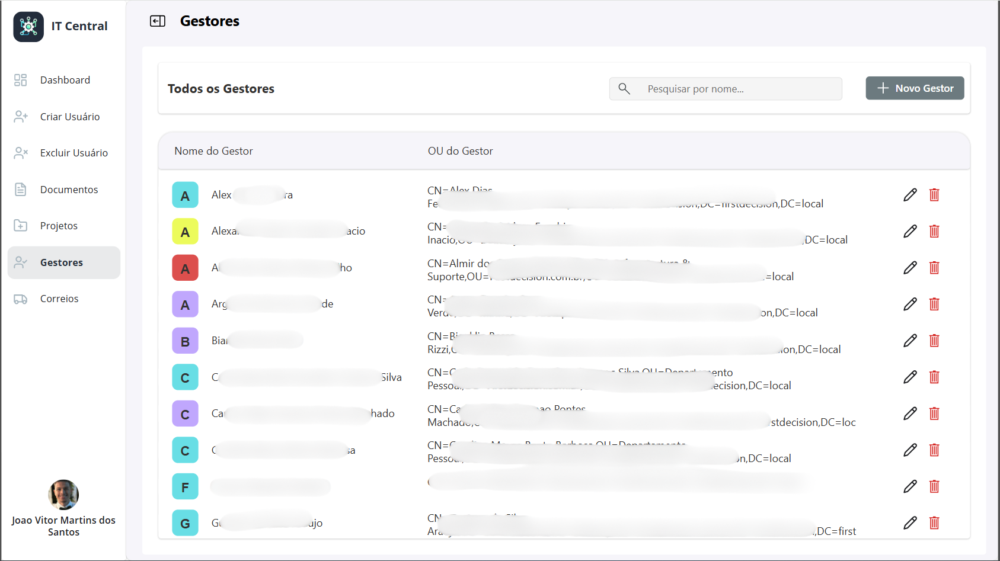

# 📱 IT Central - Gestão de Processos
### Power Apps • Power Automate • Dataverse • Active Directory

---

## 📋 Resumo do Projeto
O **IT Central** é um Hub de operações de TI desenvolvido para eliminar tarefas manuais e descentralizadas. O aplicativo padroniza processos críticos, desde a gestão de usuários no AD até a logística de equipamentos, garantindo governança e agilidade em um único ponto de acesso.

---

## 🚀 Funcionalidades Chave

### 👤 Gestão de Identidades (AD Híbrido)
* **Provisionamento:** Criação de usuários no AD Local com sincronização automática para o Azure AD (Entra ID).
* **Ciclo de Vida:** Alteração de senhas e exclusão de contas diretamente pela interface do App, eliminando a necessidade de acesso direto ao servidor por analistas.

### 📄 Automação de Documentos e Ativos
* **Gerador de Termos:** Emissão automática de contratos de Distrato e Comodato em PDF prontos para assinatura.
* **Inventário:** Atualização em tempo real da tabela de ativos e notas fiscais de patrimônio.

### 📦 Logística e Correios
* **Envio Inteligente:** Geração de Etiquetas e AR (Aviso de Recebimento) integrados para postagens.
* **Rastreio Centralizado:** Visualização consolidada do status de todas as postagens de equipamentos da TI.

### 🏢 Governança de Projetos
* **Gestores e Projetos:** Cadastro e manutenção de centros de custo, projetos e lideranças da empresa.

---

## ⚙️ Stack Técnica
* **Frontend:** Power Apps (Canvas App) com interface responsiva.
* **Backend:** Microsoft Dataverse (Tabelas relacionais).
* **Automação:** Power Automate (Fluxos de aprovação, integração com AD e engine de geração de documentos).
* **Integração:** On-premises Data Gateway para comunicação com o Active Directory Local.

---

## 📸 Demonstração Visual

### Tela Principal e Navegação

### Gestão de Documentos (Distrato/Comodato)

### Controle de Postagens e Correios

### Administração de Gestores e Projetos

