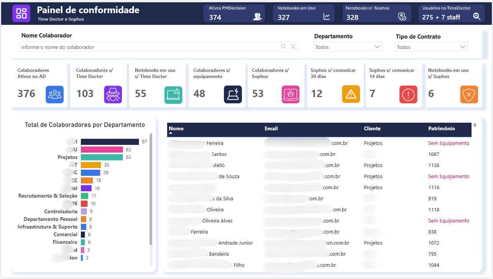
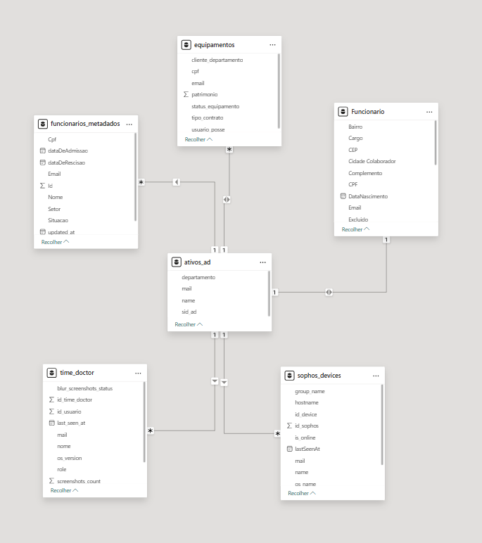

# 📊 Dashboard de Conformidade de Ativos
### Sophos × TimeDoctor × Active Directory

---

---

## 📋 Resumo do Projeto

Este projeto foi desenvolvido para **centralizar a governança de ativos de TI**, cruzando dados do **Active Directory (AD)** com ferramentas de segurança (**Sophos**) e produtividade (**TimeDoctor**). O objetivo principal era identificar lacunas de segurança e ativos sem monitoramento.

---

## 🚧 Desafios Resolvidos

| # | Desafio | Descrição |
|---|---------|-----------|
| 1 | 👤 **Visibilidade de Posse** | Identificação imediata de quais colaboradores possuem equipamentos da empresa |
| 2 | 🛡️ **Segurança de Endpoint** | Detecção de notebooks em uso sem o antivírus Sophos instalado ou ativo |
| 3 | 📡 **Monitoramento de Comunicação** | Alerta para máquinas que não reportavam ao servidor há mais de 14 ou 30 dias |
| 4 | ⏱️ **Controle de Produtividade** | Verificação de conformidade na instalação do software de monitoramento (TimeDoctor) |

---

## ⚙️ Destaques Técnicos

### 🗂️ Modelagem de Dados
Estrutura em **esquema estrela (Star Schema)** utilizando a tabela de ativos do AD como dimensão central.

### 🔄 ETL (Power Query)
Consolidação e limpeza de bases distintas para garantir a **integridade do cruzamento de dados**.

### 📐 DAX Avançado
Criação de medidas para cálculos de **prazos de inatividade** e **status de conformidade** em tempo real.

---

## ✅ Resultados

> A solução permitiu que a gestão de TI visualizasse o **status global da frota de forma ágil**, reduzindo drasticamente o tempo de resposta para incidentes de conformidade e segurança.
